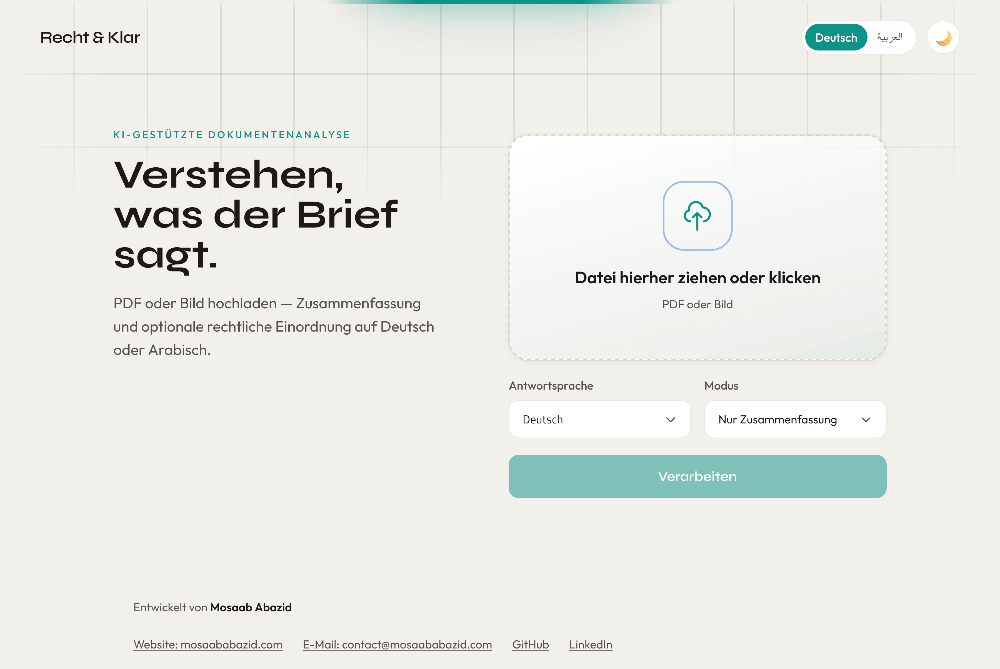
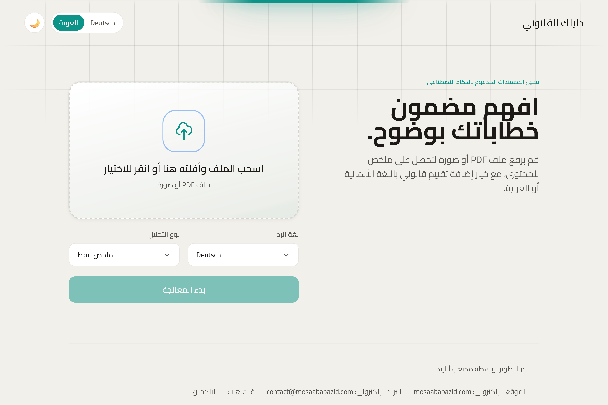
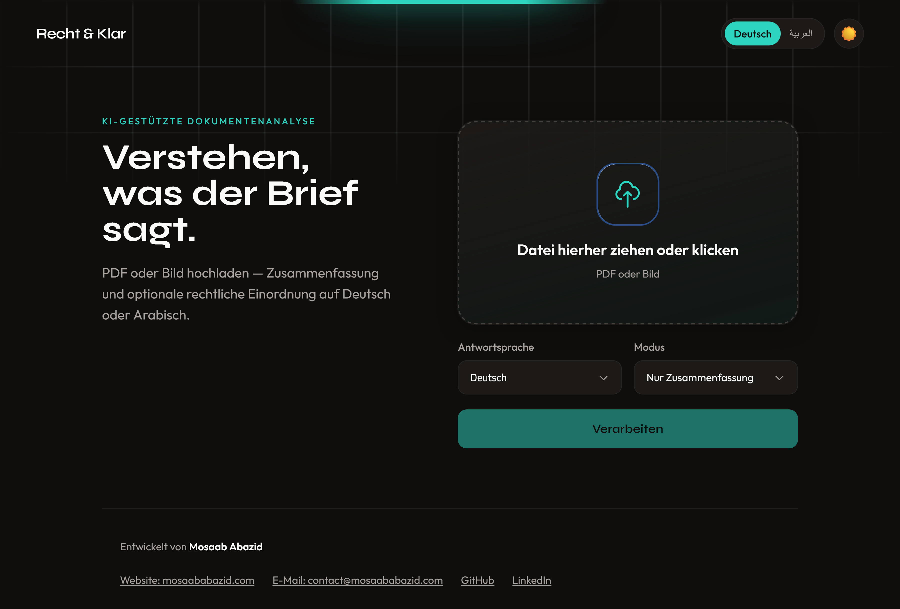
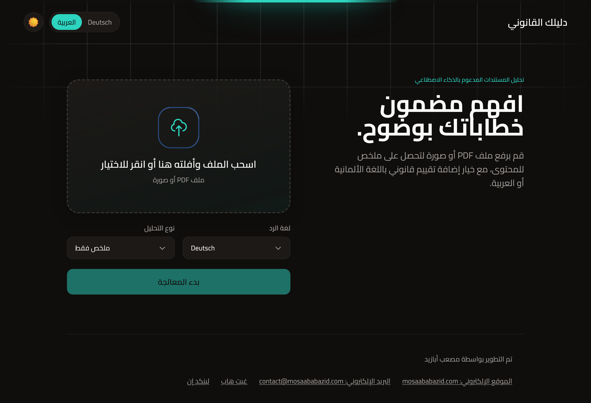

# AI Legal Assistant

AI Legal Assistant is an AI tool designed to **help Arab refugees and non-German speakers simplify and understand complex German bureaucratic documents (Amtsdeutsch)**.

It extracts text from letters, summarizes it in plain language, and offers RAG-based legal orientation from a local corpus of German laws. The user chooses the **output language** (German or Arabic); the LLM answers directly in that language.

### Frontend

Screenshots of the web interface (360×245px):

| Light, German | Light, Arabic |
|---------------|---------------|
|  |  |
|  |  |

## Core Logic & Language Processing

The system extracts text from PDFs or images, cleans it, and either summarizes it or runs RAG over the law corpus. Analysis is grounded in the retrieved passages. The user selects output language (Deutsch or Arabisch); summarization and legal advice are produced in that language by the LLM (no separate translation step for those flows).

## Tech Stack

- **Backend**: Python, FastAPI, Uvicorn
- **LLM**: Default is Groq API; you can use **any** LlamaIndex-compatible LLM (e.g. Ollama for local). Model name and provider are in `backend/app/core/config.py`; swap the LLM client in `rag_service.py` and `summarization_service.py` to use another provider.
- **RAG**: LlamaIndex, HuggingFace embeddings, hybrid retrieval (vector + BM25), persisted index in `backend/data/index_store/`.
- **OCR**: EasyOCR, Pillow, NumPy
- **PDF**: PyMuPDF
- **Translation**: Transformers (Helsinki opus-mt-de-ar) for optional DEtoAR when needed.
- **Frontend**: Next.js 15 (App Router, React 19, Tailwind) in `web/`

## Architecture (RAG Pipeline)

- **Ingestion**: Law texts (`.txt` / `.xml`) in `backend/data/raw_laws/`.
- **Embedding**: `backend/scripts/build_index.py` builds the vector index into `backend/data/index_store/`.
- **Retrieval**: Hybrid (vector + BM25) over the persisted index.
- **Generation**: LLM (default Groq) with a strict prompt; answers only from retrieved context and in the user-chosen language.

## Mission (Social Impact)

German bureaucracy is hard even for native speakers. For refugees and newcomers, it can be risky: unclear letters can lead to missed deadlines, lost benefits, or avoidable penalties.

This project focuses on:

- **Immediate comprehension**: OCR/PDF text extraction and clear summarization of bureaucratic letters in German, ensuring legal accuracy.
- **Language access**: Optional German-to-Arabic translation to bridge the language gap quickly, helping Arab refugees understand complex Amtsdeutsch without losing legal precision.
- **Grounded legal context**: RAG-backed responses grounded in an explicit local corpus to reduce hallucinations and provide reliable legal guidance.

By making German bureaucratic documents accessible and understandable, this tool helps prevent misunderstandings that could result in missed legal deadlines, lost social benefits, or unnecessary penalties—critical support for people navigating a new legal system.

## Project Layout

The repo is split into two parts:

- **`backend/`** — Python FastAPI API (OCR, PDF, summarization, translation, RAG)
  - `app/main.py`: FastAPI entry point
  - `app/api/`, `app/services/`, `app/core/`, `app/utils/`
  - `scripts/`: `law_scraper.py`, `build_index.py`
  - `data/`: `raw_laws/`, `index_store/`
- **`web/`** — Next.js 15 frontend (App Router, React 19, Tailwind)

See **`backend/README.md`** and **`web/README.md`** for per-project setup and run instructions.

## Setup & Run

### Prerequisites

- Python 3.11+ (backend), Node.js 18+ (frontend)
- **LLM**: Default is Groq — get a key at [console.groq.com](https://console.groq.com) and set `GROQ_API_KEY` in `backend/.env`. You can instead use a local LLM (e.g. [Ollama](https://ollama.com)) or another API by changing the model in `backend/app/core/config.py` and the LLM client in the backend services.

### Backend

From the **`backend/`** directory:

```bash
cd backend
cp .env.example .env   # for Groq: set GROQ_API_KEY
python -m venv .venv
.\.venv\Scripts\Activate.ps1   # Windows PowerShell
pip install -r requirements.txt
# Optional: build RAG index from data/raw_laws (required for legal-advice mode)
python scripts/build_index.py
python -m uvicorn app.main:app --reload --host 127.0.0.1 --port 8000
```

API: **http://127.0.0.1:8000/**

### Frontend

From the **`web/`** directory:

```bash
cd web
cp .env.local.example .env.local
npm install
npm run dev
```

Open **http://localhost:3000/** and ensure the backend is running at `http://127.0.0.1:8000`. To use another API URL, set `NEXT_PUBLIC_API_URL` in `web/.env.local`.

## Usage

1. **Upload a document**: Select a PDF or image file containing German bureaucratic text.
2. **Choose language**: Select German (Deutsch) or Arabic (Arabisch) for the output language.
3. **Select mode**:
   - **Nur Zusammenfassung**: Extracts and summarizes the document text.
   - **Zusammenfassung + rechtliche Einordnung**: Provides summary plus RAG-based legal analysis using the German law corpus.

Output is in the selected language (German or Arabic). Legal-advice mode requires the vector index (`python scripts/build_index.py` from `backend/`).
